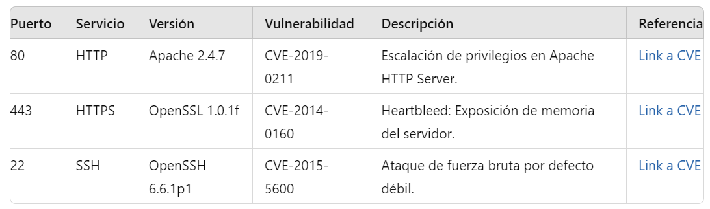

# Escanear puertos con nmap

<!-- hide -->

> By [@rosinni](https://github.com/rosinni) and [other contributors](https://github.com/4GeeksAcademy/deploying-wordpress-debian/graphs/contributors) at [4Geeks Academy](https://4geeksacademy.co/)

[](https://4geeks.com)
[](https://twitter.com/4geeksacademy)

*These instructions are [available in english](https://github.com/breatheco-de/scan-with-nmap-practice/blob/main/README.md)*
<!-- endhide -->


<!-- hide -->


### Antes de empezar...

> ¡Te necesitamos! Estos ejercicios se crean y mantienen en colaboración con personas como tú. Si encuentras algún error o falta de ortografía, contribuye y/o repórtalo.

<!-- endhide -->

## 🌱 ¿Cómo empezar este proyecto?

En esta práctica, aprenderemos a utilizar Nmap, una herramienta de código abierto ampliamente reconocida para el análisis de redes y la seguridad. Con Nmap llevaremos a cabo escaneos en una máquina objetivo (en este caso, una máquina con Debian) desde una máquina con Kali Linux. 

Identificaremos hosts activos, puertos abiertos en la red y qué servicios están operando en esos puertos, para buscar posibles vulnerabilidades en los servicios detectados y comprender las debilidades de seguridad que pueden existir en la red.


### Requisitos

* Máquina virtual con Kali Linux (Maquina para scanear)
* Máquina virtual con Debian (Maquina objetivo): Realizaremos escaneos en esta máquina para identificar puertos abiertos, servicios activos y posibles vulnerabilidades.

## 📝 Instrucciones

* Abre esta URL y forkea el siguiente repositorio https://github.com/breatheco-de/scan-with-nmap-practice

 

Un nuevo repositorio se creará en tu cuenta.

* Clona este nuevo repositorio forkeado utilizando Git para descargartelo a tu maquina local.
* Una vez que hayas clonado, sigue los pasos de mas abajo hasta el final.


### Paso 1: Escaneo con Nmap
En la maquina kali realizaremos un escaneo con Nmap para descubrir los hosts activos y los puertos abiertos en una red o en un dispositivo específico.

- [] Instalación de Nmap (si no está instalado):
```bash
sudo apt-get install nmap
```

- [] Escaneo básico de un objetivo (El IP de la maquina debian <IP_debian>):
```bash
nmap <IP_debian>
```

### Paso 2: Enumerar Puertos y Verificar Servicios
Después de realizar el escaneo, Nmap proporcionará una lista de puertos abiertos y los servicios que operan en esos puertos.

- [] Escaneo de puertos y servicios:
```bash
nmap -sV <IP_debian>
```
> Esta opción (-sV) permite detectar la versión del servicio que está operando en cada puerto.

- [] Escaneo detallado y búsqueda de vulnerabilidades:
```bash
nmap -sV --script=vuln <IP_debian>
```
> La opción (--script=vuln) ejecuta scripts de detección de vulnerabilidades que Nmap tiene incorporados.

### Paso 3: Documentar Vulnerabilidades Asociadas a los Servicios

- [] Anota los Servicios y sus Versiones Del resultado del escaneo, toma nota de los servicios y sus versiones. Por ejemplo:
    * Apache 2.4.7
    * OpenSSL 1.0.1f
    * OpenSSH 6.6.1p1

* Buscar Vulnerabilidades en Bases de Datos Públicas. Utiliza bases de datos públicas de vulnerabilidades para buscar información sobre los servicios detectados. Las siguientes son las fuentes más comunes:
    * NVD (National Vulnerability Database): https://nvd.nist.gov/
    * CVE Details: https://www.cvedetails.com/
    * Exploit Database: https://www.exploit-db.com/
    * Vulners: https://vulners.com/

> 💡Ejemplo: Para el servicio Apache 2.4.7, ve a la página de NVD: https://nvd.nist.gov/ e
ingresa "Apache 2.4.7" en la barra de búsqueda.

- [] Documenta las vulnerabilidades de manera estructurada. Aquí tienes un ejemplo de cómo documentar una vulnerabilidad:



## Entrega de proyecto

* En la raiz del proyecto forkeado, sube el  reporte en formato `.pdf` con el nombre `vulnerability-report.pdf`


